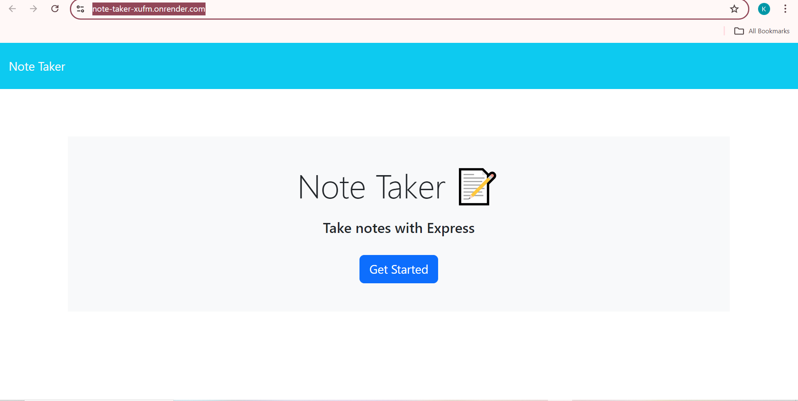
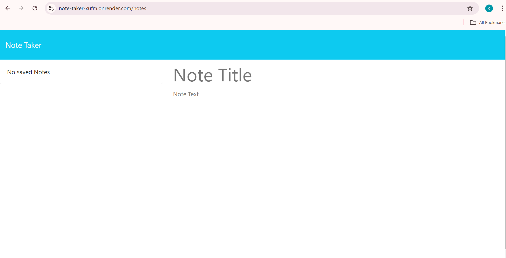
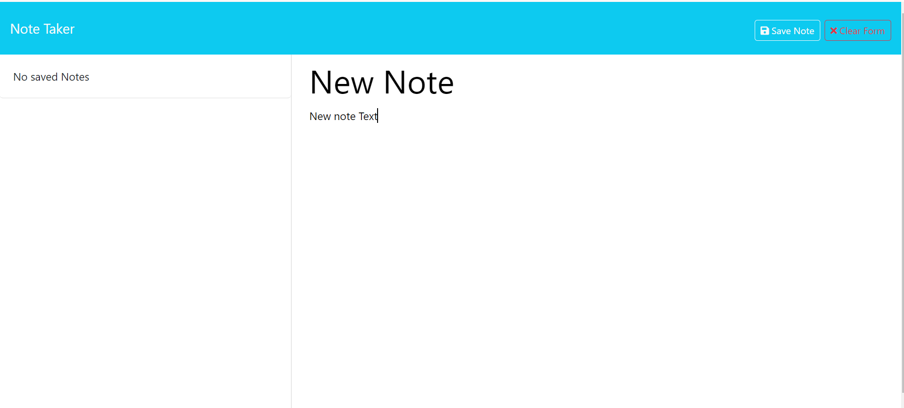
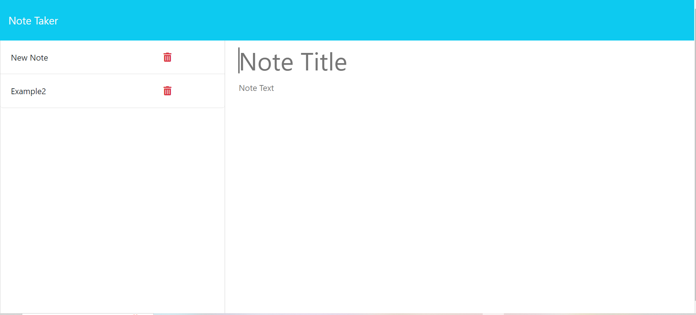
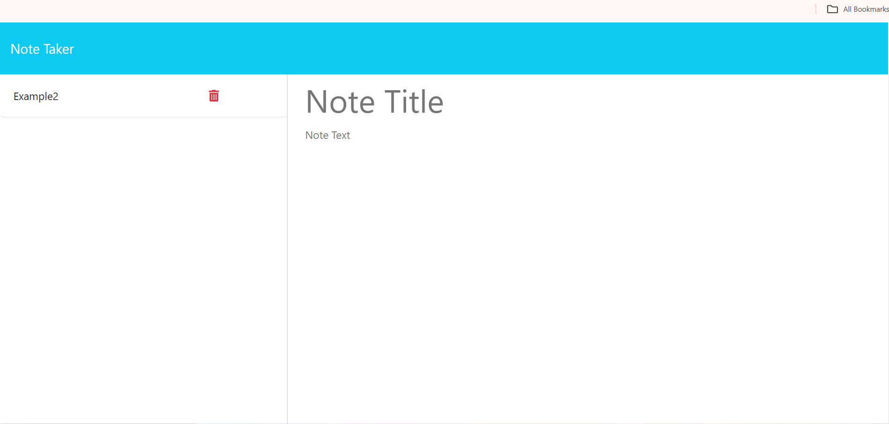

# Note Taker

## Description

This application allows the user to write notes, save the content of the notes to a file, and delete select notes.

## Installation

To install necessary dependencies, run the following command:

...

'npm i'
...

## Usage

To use this application, click the "Get Started" button on the front page. A side bar with saved notes will appear on the left, and on the right will be a space to write the title and text for your note. As you start writing the text of your note, a save note button will appear; click the button to save your note. A "Clear Form" button also appears when creating the note; click this to clear the content of your note. You can delete a note by clicking the trash can next to the saved note, and it will be permanently erased.

[Deployed Application](https://note-taker-xufm.onrender.com/)

N/A

## License

LICENSE in repo.
